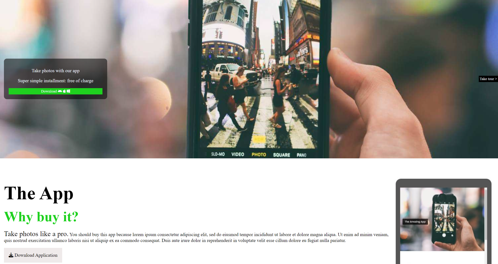
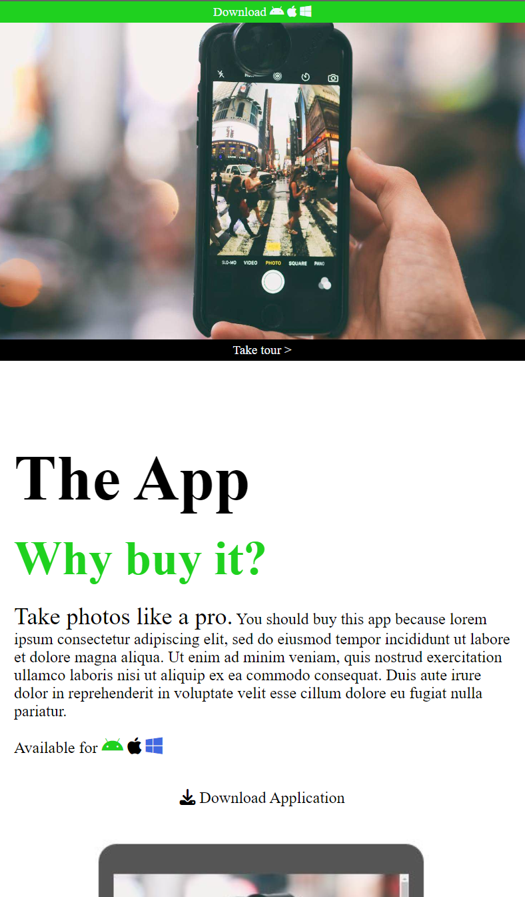

# Création d'une application responsive appler app2

Pendant ma formation " préparation du métier du numérique et de l'informatique " j'ai travillé sur une application qui passe du format pc en format mobile et inversement. 
Ceci est le travail terminer.
## Screenshots





## Deployment

To deploy this project run

```bash
  node index.js
   
```


## Documentation

[app2](https://github.com/delamare-david/app2)


## Features

- Light/dark mode toggle
- Live previews
- Fullscreen mode
- Cross platform


## License

[MIT](https://choosealicense.com/licenses/mit/)

